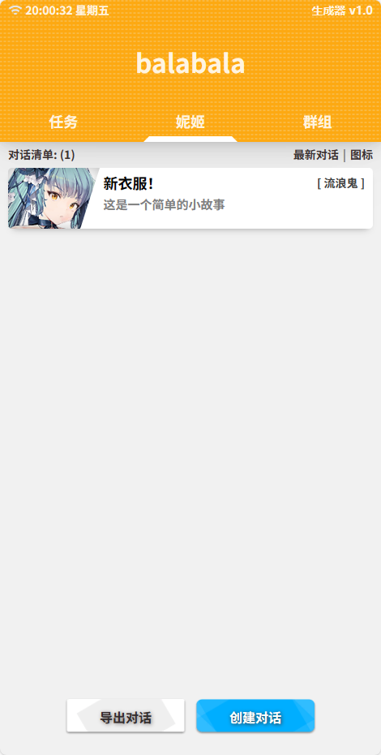
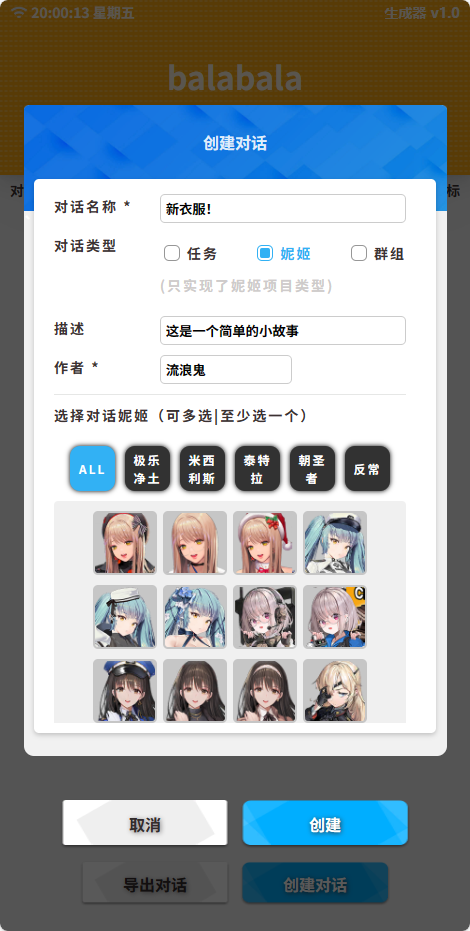

# NIKKE 巴拉巴拉生成器

仿照游戏内巴拉巴拉聊天框开发的一款对话生成器，方便玩家进行剧情上的创作，包含游戏内大部分的妮姬和NPC。

- [在线地址](https://notfacegui.github.io/)

## 效果预览

### 界面

### 导出预览

## 待开发项目

- [x] 仿 nikke UI界面开发
- [x] 对话框架搭建
- [x] 支持png导出
- [x] 图片消息类型支持
- [x] 支持jpeg导出
- [x] 旁白消息类型
- [x] 分割消息类型
- [x] 自定义对话对象
- [x] 对话数据修改
- [x] 项目持久化
- [x] 消息动态编辑
- [ ] -----------

## 使用教程

正在编写中……

## 本地部署
1.3.1 版本后提供本地可执行文件 前往下载即可

## 声明

素材来自网络,如侵权请联系删除!
